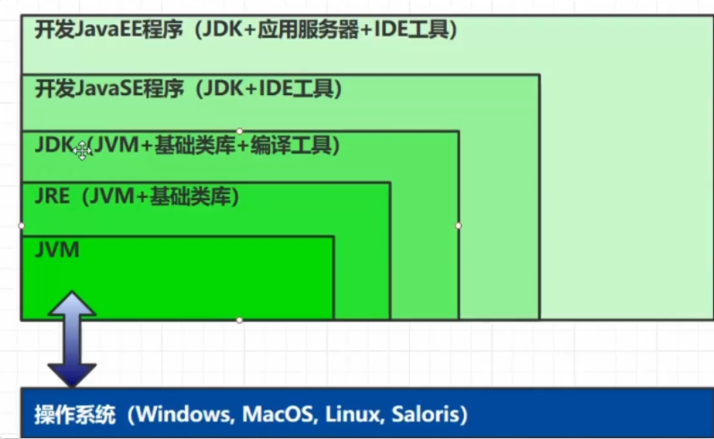
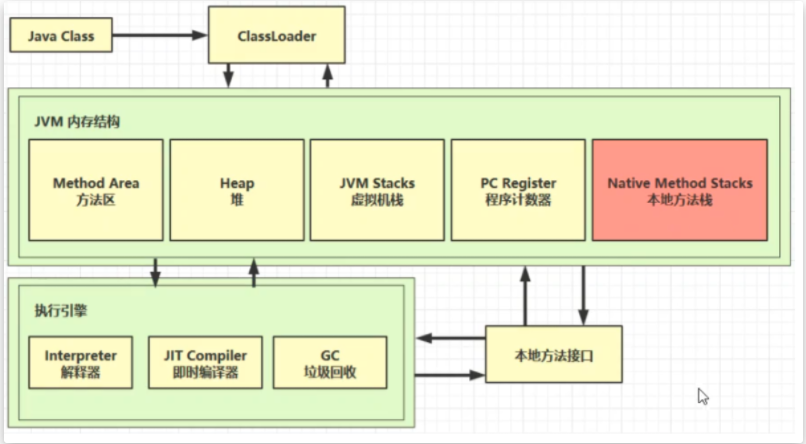
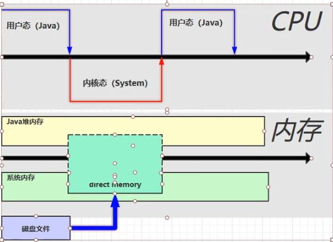
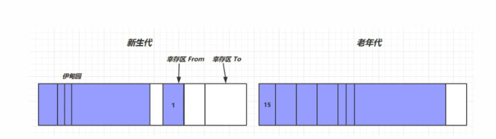
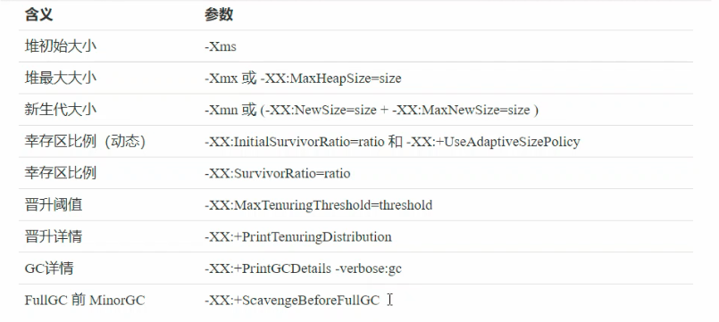
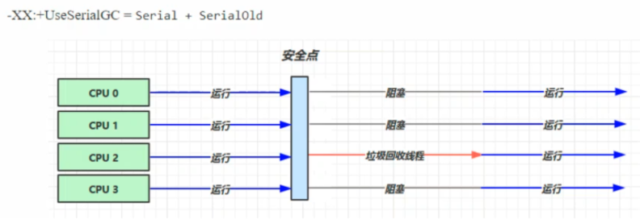
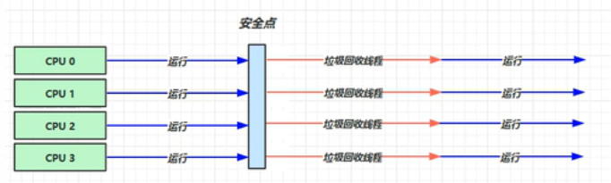
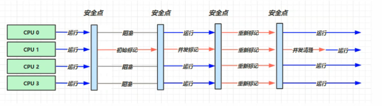

# JVM学习

本博客是根据[黑马程序员](https://www.bilibili.com/video/BV1yE411Z7AP?spm_id_from=333.999.0.0)教学视频学习时，所做的笔记

## 一、什么是JVM

### 定义

Java Virtual Machine，JAVA程序的 **运行环境** （JAVA二进制字节码的运行环境）

### 好处

* 一次编写，到处运行
* 自动内存管理，垃圾回收机制
* 数组下标越界检查

### 比较

JVM、JRE、JDK的区别



## 二、内存结构

### 整体架构



### 1.程序计数器（寄存器）

##### 作用

用于保存JVM(字节码文件)中下一条所要执行的指令地址

##### 特点

* 线程私有
* 不会存在内存溢出

### 2.虚拟机栈

##### 定义

* 每个线程运行时所需要的内训，称为虚拟机栈
* 每个栈由多个栈帧(Frame)组成，对应着每次方法调用时所占用的内存
* 每个线程只能有一个活动栈帧，对应着当前正在执行的那个方法

##### 问题辨析

1.垃圾回收是否涉及栈内存？

* **不需要** 。因为虚拟机栈中是由一个个栈帧组成的，在方法执行完毕后，对应的栈帧就会被弹出栈。所以无需通过垃圾回收机制去回收内存

2.栈内存的分配越大越好吗？

* 不是。因为 **物理内存是一定的** ，栈内存越大，可以支持更多的递归调用，但是可执行的线程数就会越少

3.方法内部的局部变量是都时线程安全的？

* 如果方法内局部变量没有逃离方法的作用访问，它是线程安全的
* 如果是局部变量引用了对象，并逃离方法的作用范围，需要考虑线程安全

##### 栈内存溢出

**-Xss：栈内存大小**

**Java.lang.stackOverflowError** 栈内存溢出

出现原因

* 栈帧过多导致栈内存溢出(无限递归)
* 栈帧过大导致栈内存溢出

##### 线程运行诊断

案例1：cpu占用过多

定位:

* **top** 命令定位哪个进程对cpu的占用过高
* **ps H -eo pid,tid(线程id),%cpu | grep pid(top查询的进程id替换)** 通过ps命令进一步查看是哪个线程占用CPU过高
* **jstack pid**  查看进程中线程信息，通过 tid 对应 nid 确定问题线程，**注意：ps查询出来的tid为十进制，jstack查询nid为十六进制，需要进行转换**

案例2：程序运行很长时间没有结果

定位：

* **jstack pid** 查看，可能有死锁(deadlock)

### 3.本地方法栈

一些带有**native关键字**的方法就是需要JAVA去调用本地的C或者C++方法，因为JAVA有时候没法直接和操作系统底层交互，所以需要用到本地方法，如：Object类下面的 clone()等方法

### 4.堆Heap

##### 定义

通过 **new** 关键字，创建对象都会使用堆内存

##### 特点

* 它是线程共享的，堆中对象都需要考虑线程安全的问题
* 有垃圾回收机制

##### 堆内存溢出

**-Xmx：堆内存最大值**

**-Xms：堆内存最小值**

**java.lang.OutofMemoryError** ：java heap space. 堆内存溢出

##### 堆内存诊断

1.jps 工具

* 查看当前系统中有哪些java进程

2.jmap 工具

* **jmap -heap pid** 查看某一时刻堆内存占用情况

3.jconsole 工具

* 图形界面，多功能的监测工具，可以连续检测(jconsole 命令打开图形界面)

4.jvisualvm

* 图形界面，功能更强大，可以连续检测(jvisualvm 命令打开界面)

案例：垃圾回收后，内存占用仍然很高

* jvisualvm 可以具体查看对象占用内存的大小

### 5、方法区

方法区只是一个概念，永久代和元空间为它的落地实现

##### 定义

* 方法区（Method Area）与 Java 堆一样，是所有线程共享的内存区域。
* 虽然 Java 虚拟机规范把方法区描述为堆的一个逻辑部分，但是它却有一个别名叫 Non-Heap（非堆），目的应该是与 Java 堆区分开。
* 运行时常量池（Runtime Constant Pool）是方法区的一部分。Class 文件中除了有类的版本/字段/方法/接口等描述信息外，还有一项信息是常量池（Constant Pool Table），用于存放编译期生成的各种字面量和符号引用，这部分内容将类在加载后进入方法区的运行时常量池中存放。运行期间也可能将新的常量放入池中，这种特性被开发人员利用得比较多的是 `String.intern()`方法。受方法区内存的限制，当常量池无法再申请到内存时会抛出 `OutOfMemoryErro`r 异常。
* 方法区的大小和堆空间一样，可以选择固定大小也可选择可扩展，方法区的大小决定了系统可以放多少个类，如果系统类太多，导致方法区溢出，虚拟机同样会抛出内存溢出错误
* JVM 关闭后方法区即被释放

##### 内存溢出

Java7 中我们可以通过 `-XX:PermSize` 和 `-xx:MaxPermSize` 来设置永久代参数，Java8 之后，随着永久代的取消，这些参数也就随之失效了，改为通过 `-XX:MetaspaceSize` 和 `-XX:MaxMetaspaceSize` 用来设置元空间参数

* 1.8以前会导致**永久代**内存溢出(动态加载类太多)
* 1.8以后会导致**元空间**内存溢出(动态加载类太多)

##### 常量池

定义：一个有效的字节码文件中除了包含类的版本信息、字段、方法以及接口等描述信息外，还包含一项信息那就是常量池表（Constant Pool Table），包含各种字面量和对类型、域和方法的符号引用

运行时，常量池中的信息，都会被加载要运行时常量池，这时 常量池中的符号还没有变为 java 对象

##### StringTable(串池)

`ldc    #2 `字节码指令  会把常量池中 符号 变为 字符串对象，串池中不存在，则放入StringTable(串池)

`javap -v 类的绝对路径` 反编译class文件

特性：

* 常量池中的字符串仅是符号，只有**在被用到时才会转化为对象**
* 利用串池的机制，来避免重复创建字符串对象
* 字符串**变量**拼接的原理是**StringBuilder**
* 字符串**常量**拼接的原理是**编译器优化**
* 可以使用 **intern方法** ，主动将串池中还没有的字符串对象放入串池中

动态拼接字符串

```java
String s1 = "a";
String s2 = "b";
String s3 = "ab";
String s  = s1 + s2;    //动态拼接字符串，不放入串池，拼接原理是StringBuilder，会new String("ab")，为堆上对象，会有编译期优化
System.out.println(s == s3);    //s3在串池，是不在串池 ，结果为false

// s.intern() 将这个字符串对象尝试放入串池，如果有则不会放入，jdk1.6会拷贝一份放入，本身s对象不会放入
String s4 = s.intern();    //串池中已经有ab，s不会放入串池
System.out.println(s4 == s3);   //s没有放入串池，结果为false
System.out.println(s == s3);   //s没有放入串池，结果为false

```

StringTable位置

1.6之前 StringTable在常量池中，也就是在永久代中(方法区的落地实现)

1.6之后 StringTable在堆中

StringTable垃圾回收

以哈希表的形式保存，内存不足时会发生垃圾回收

StringTable性能调优

* 调整-XX：StringTableSize=桶个数
* 考虑字符串对象是否入池，字符串入池(intern()方法)会减少内存的占用

### 6、直接内存

Direct Memory

##### 定义

* 常见于NIO操作时，用于数据缓冲区
* 分配回收成本较高，但读写性能高
* 不受JVM内存回收管理

##### 基本使用

直接内存是操作系统和Java代码 **都可以访问的一块区域** ，无需将代码从系统内存复制到Java堆内存，从而提高了效率



##### 内存溢出

**java.lang.OutofMemoryError: Direct buffer memory**

##### 释放原理

直接内存的回收不是通过JVM的垃圾回收来释放的，而是通过**unsafe.freeMemory**来手动释放

```java
public class Demo01 {
    static int _1GB = 1024 * 1024;

    public static void main(String[] args) throws IOException {
        ByteBuffer byteBuffer = ByteBuffer.allocateDirect(_1GB);
        System.out.println("分配完毕...");
        System.in.read();
        System.out.println("开始释放...");
        byteBuffer = null;
        System.gc();    //byteBuffer对象被回收时，底层主动调用unsafe.freeMemory方法释放直接内存
        System.in.read();
    }

}
```

**-XX:+DisableExplicitGC** 禁用显示的垃圾回收，System.gc()失效，影响直接内存无法释放，需要手动释放

System.gc() 为显示的垃圾回收，Full GC

### 7、垃圾回收

##### 如何判断对象可以回收

###### **1.引用计数法**

某一个对象被引用则计数加1，不再引用则减1，变为0时，可作为垃圾回收

**弊端：**循环引用，A对象引用B对象，B对象引用A对象，造成内存泄漏

###### **2.可达性分析算法**

* Java虚拟机中的垃圾回收器采用可达性分析来探索所有存活的对象
* 扫描队中的对象，看是否能都沿着GC Root(根对象)对象为七点的引用链找到该对象，找不到，表示可以回收
* 可以作为GC Root的对象
  （1）虚拟机栈(栈帧中的本地变量表)中引用的对象
  （2）方法区中类静态属性引用的对象
  （3）方法区中常量引用的对象
  （4）本地方法栈中JNI(一版说的Native对象)引用的对象

##### 五种引用

###### 1.强引用

* 只有所有GC Root对象都不通过【强引用】引用该对象时，该对象才能被垃圾回收

###### 2.软引用(SoftReference)

* 只有软引用引用该对象时，在垃圾回收后，内存仍不足时会再次触发垃圾回收，回收软引用对象
* 当软引用对象被回收之后，软引用自身会进入引用队列，可以配合引用队列(ReferenceQuene)来释放软引用自身

###### 3.弱引用(WeakReference)

* 只有弱引用引用对象，在垃圾回收时，无论内存是否充足，都会回收弱引用对象
* 当弱引用对象被回收之后，弱引用本身会进入引用队列，可以配合引用队列(ReferenceQuene)来释放自身

###### 4.虚引用(PhantomReference)

* 必须配合引用队列使用，主要配合ByteBuffer使用，被引用对象回收时，会将虚引用入引用队列，由Reference Handler线程调用虚引用相关方法释放直接内存

###### 5.终结器引用(FianlReference)

* 无需手动编码，但其内部配合引用队列使用，在垃圾回收时，终结器引用入引用队列(被引用对象暂时没有被回收)，再由Finalizer线程通过终结器引用找到引用对象并调用它的finallize方法，第二次GC时才能回收被引用对象

##### 垃圾回收算法

###### 1.标记清除

标记清除算法顾名思义，是指在虚拟机执行垃圾回收的过程中，先采用标记算法确定可回收对象，然后垃圾收集器根据标识清除相应的内容，给堆内存腾出相应的空间

* 这里的腾出内存空间并不是将内存空间的字节清0，而是记录下这段内存的起始结束地址，下次分配内存的时候，会直接**覆盖**这段内存，速度较快
* **容易产生大量的内存碎片** ，可能无法满足大对象的内存分配，一旦导致无法分配对象，那就会导致jvm启动gc，一旦启动gc，我们的应用程序就会暂停，这就导致应用的响应速度变慢

###### 2.标记整理

会将不被GC Root引用的对象回收，清楚其占用的内存空间。然后整理剩余的对象，可以有效避免因内存碎片而导致的问题，但是因为整体需要消耗一定的时间，所以效率较低

###### 3.复制

内存分为等大小的两个区域，FROM和TO（TO中为空）。先将被GC Root引用的对象从FROM放入TO中，再回收不被GC Root引用的对象。然后交换FROM和TO。这样也可以避免内存碎片的问题，但是会占用双倍的内存空间。

##### 分代回收



###### 原理

* 对象首先分配在伊甸园区域
* 新生代空间不足时，触发Minor GC，伊甸园和From存活的对象使用copy算法复制到To中，存活的对象年龄加1，并且交换From 和 To
* Minor GC 会引发 Stop the world，暂停其他用户的线程，等待垃圾回收结束后，用户线程在恢复运行
* 当对象寿命超过阈值时，会晋升至老年代，最大寿命时15(4bit)
* 当老年代空间不足，先尝试触发Minor GC，如果之后空间任然不足，那么触发Full GC，Stop the world时间更长
* 空间还是不足，则 内存溢出，抛出异常

###### GC相关参数



##### 垃圾回收器

###### 1.串行

-XX:+UseSerialGC=Serial + SerialOld

* 单线程
* 堆内存小，适合个人电脑



**安全点** ：让其他线程都在这个点停下来，以免垃圾回收时移动对象地址，使得其他线程找不到被移动的对象

因为是串行的，所以只有一个垃圾回收线程。且在该线程执行回收工作时，其他线程进入**阻塞**状态

**Serial 收集器**

Serial收集器是最基本的、发展历史最悠久的收集器

**特点：** 单线程、简单高效（与其他收集器的单线程相比），采用 **复制算法** 。对于限定单个CPU的环境来说，Serial收集器由于没有线程交互的开销，专心做垃圾收集自然可以获得最高的单线程手机效率。收集器进行垃圾回收时，必须暂停其他所有的工作线程，直到它结束（Stop The World）

**ParNew 收集器**

ParNew收集器其实就是Serial收集器的多线程版本

**特点** ：多线程、ParNew收集器默认开启的收集线程数与CPU的数量相同，在CPU非常多的环境中，可以使用-XX:ParallelGCThreads参数来限制垃圾收集的线程数。和Serial收集器一样存在Stop The World问题

**Serial Old 收集器**

Serial Old是Serial收集器的老年代版本

**特点** ：同样是单线程收集器，采用**标记-整理算法**

###### 2.吞吐量优先

-XX:+UseParallelGC ~ -XX:+UseparallelOldGC

-XX:UseAdaptiveSizePolicy

-XX:GCTimeRatio=ratio

-XX:MaxGCPauseMillis=ms

-XX:ParallelGCThreads=n

* 多线程
* 堆内存较大，多核cpu支持
* 让单位时间内，STW 的时间最短
* **JDK1.8默认使用**的垃圾回收器



**Parallel Scavenge 收集器**

与吞吐量关系密切，故也称为吞吐量优先收集器

**特点** ：属于新生代收集器也是采用**复制算法**的收集器（用到了新生代的幸存区），又是并行的多线程收集器（与ParNew收集器类似）

该收集器的目标是达到一个可控制的吞吐量。还有一个值得关注的点是： **GC自适应调节策略** （与ParNew收集器最重要的一个区别）

**GC自适应调节策略** ：Parallel Scavenge收集器可设置-XX:+UseAdptiveSizePolicy参数。当开关打开时**不需要**手动指定新生代的大小（-Xmn）、Eden与Survivor区的比例（-XX:SurvivorRation）、晋升老年代的对象年龄（-XX:PretenureSizeThreshold）等，虚拟机会根据系统的运行状况收集性能监控信息，动态设置这些参数以提供最优的停顿时间和最高的吞吐量，这种调节方式称为GC的自适应调节策略。

Parallel Scavenge收集器使用两个参数控制吞吐量：

* XX:MaxGCPauseMillis 控制最大的垃圾收集停顿时间
* XX:GCRatio 直接设置吞吐量的大小

**Parallel Old 收集器**

是Parallel Scavenge收集器的老年代版本

**特点** ：多线程，采用 **标记-整理算法** （老年代没有幸存区）

###### 3.响应时间优先

-XX:+UseConcMarkSweepGC ~ -XX:+UseParNewGC ~ SerialOld

-XX：ParallelGCThreads=n ~ -XX:ConcGCThreads=threads

-XX:CMSInitiatingOccupancyFraction=percent

-XX:+CMSScavengeBeforeRemark

* 多线程
* 堆内存较大，多核cpu支持
* 尽可能让单次 STW 时间最短



**CMS 收集器**

Concurrent Mark Sweep，一种以获取**最短回收停顿时间**为目标的**老年代**收集器

**特点** ：基于**标记-清除算法**实现。并发收集、低停顿，但是会产生内存碎片

**应用场景** ：适用于注重服务的响应速度，希望系统停顿时间最短，给用户带来更好的体验等场景下。如web程序、b/s服务

**CMS收集器的运行过程分为下列4步：**

**初始标记** ：标记GC Roots能直接到的对象。速度很快但是**仍存在Stop The World问题**

**并发标记** ：进行GC Roots Tracing 的过程，找出存活对象且用户线程可并发执行

**重新标记** ：为了**修正并发标记期间**因用户程序继续运行而导致标记产生变动的那一部分对象的标记记录。仍然存在Stop The World问题

**并发清除** ：对标记的对象进行清除回收

CMS收集器的内存回收过程是与用户线程一起**并发执行**的
